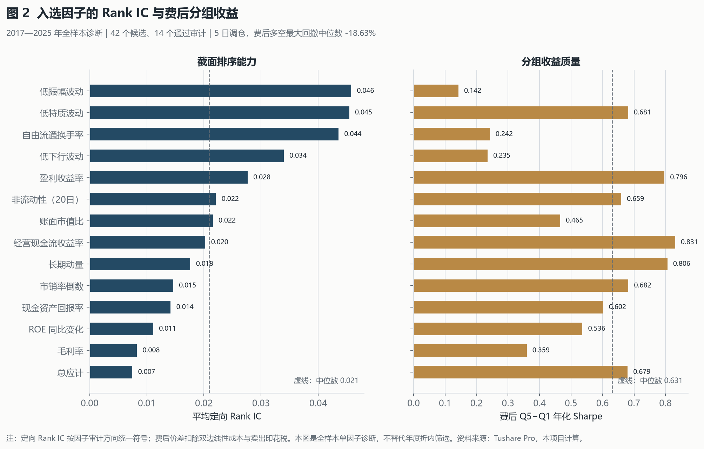
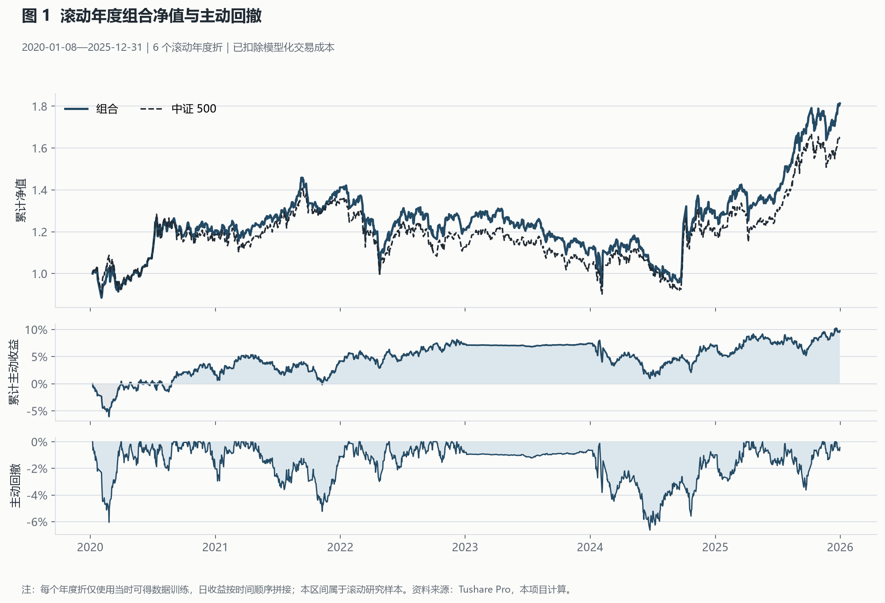

# 中证 500 时点一致多因子主动组合研究

[](https://github.com/Lithnio/csi500-alpha-research/actions/workflows/ci.yml)


这是一个面向 A 股主动量化研究的完整实现：从 Tushare Pro 原始数据出发，构建历史中证 500 成分和时点一致因子，完成因子检验、信号合成、收益校准、风险估计、组合优化、次日开盘执行及结果审计。

v2.1 没有更换策略或重新选择回测结果，主要补齐了从单因子到合成信号、再到可交易组合的证据链，并重新整理公开报告。

## 核心研究证据

| 层级 | 样本与口径 | 排序或收益质量 | 风险与稳定性 |
|---|---|---|---|
| 单因子 | 2017—2025 全样本审计；42 个候选中 14 个入选 | 定向 Rank IC 中位数 0.0209；费后 Q5−Q1 Sharpe 中位数 0.631 | 费后多空最大回撤中位数 -18.63% |
| 合成信号 | 2020—2025 滚动年度折；236 个有效决策日 | 日均 Rank IC 0.0345；Q5−Q1 平均 9.87 个基点，年化 Sharpe 0.498 | 分组收益最大回撤 -9.82%；该层未扣交易成本 |
| 主动组合 | 2020—2025 六个互不重叠年度折；已扣模型化成本 | 年化主动收益 1.64%；信息比率 0.388；5/6 年为正 | 主动最大回撤 -6.64%；组合绝对 Sharpe 0.601 |

单因子指标用于描述因子池质量，不是样本外业绩；合成信号的分组收益为费前诊断；只有组合层计入完整执行和交易成本。三类指标不能直接横向比较。



14 个入选因子覆盖估值、风险、流动性、质量、成长、动量和应计七类暴露。单因子 Rank IC 与费后分组 Sharpe 并非严格单调：低波动类因子排序能力较强，但部分因子的分组收益质量较弱；现金流、盈利收益率和长期动量的 Rank IC 不居前，费后 Sharpe 反而较高。因此组合阶段保留家族分散和成本门槛，不按单一 IC 排名集中配权。

## 滚动组合结果

| 指标 | 结果 |
|---|---:|
| 评价区间 | 2020-01-08—2025-12-31 |
| 组合 / 基准累计收益 | 81.34% / 65.22% |
| 累计相对收益 | 9.76% |
| 年化主动收益 / 信息比率 | 1.64% / 0.388 |
| 组合 / 基准绝对 Sharpe（无风险利率取 0） | 0.601 / 0.516 |
| 组合 / 基准最大回撤 | -35.67% / -35.91% |
| 跟踪误差 / 主动最大回撤 | 4.45% / -6.64% |
| CAPM 年化 α / β | 2.02% / 0.956 |
| 正主动收益年度 / 最差年度 | 5/6 / -0.34% |
| 平均单期换手 / 执行成本 | 2.22% / 11.05 个基点 |
| 成交金额完成率 / 优化求解率 | 99.74% / 98.96% |



| 年度 | 年化主动收益 |
|---:|---:|
| 2020 | 1.70% |
| 2021 | 2.64% |
| 2022 | 3.14% |
| 2023 | 0.16% |
| 2024 | -0.36% |
| 2025 | 2.62% |

2023 年折内没有因子通过筛选，模型输出零主动预测；该年的小幅主动收益来自基准跟踪和模拟执行偏差，不能归因于选股信号。

预先登记的 12 项发布门槛通过 8 项。未通过的四项为：年化主动收益 1.64%（门槛 3.00%）、信息比率 0.388（门槛 0.800）、主动最大回撤 -6.64%（门槛 -6.00%）和滚动 β 偏离 95% 分位数 0.163（门槛 0.100）。这些结果随版本公开保留，没有事后调整门槛。

脱敏汇总见 [v2-public-summary.json](docs/assets/v2-public-summary.json)，来源与图片指纹见 [v2-report-manifest.json](docs/assets/v2-report-manifest.json)。

## 研究流程

```text
Tushare 数据与请求缓存
  → 历史成分、复权行情、行业、交易状态和财务可得时点
  → 截面因子处理与折内筛选
  → 因子家族合成与滚动收益校准
  → 协方差、Beta 和主动风险估计
  → 约束组合优化
  → 下一交易日开盘执行、成本与容量模拟
  → 年度滚动评价、完整性审计和聚合报告
```

| 区间 | 用途 |
|---|---|
| 2016 | 长窗口因子、复权和风险估计预热 |
| 2017—各评价折开始前 | 扩展训练窗和折内因子筛选 |
| 2020—2025 | 六个互不重叠的年度评价折 |

标签为决策日后第一个开盘价至第六个开盘价的个股收益相对中证 500 收益。训练样本必须在拟合日前完成标签观测，并额外隔离 5 个交易日。因子在每日截面内完成稳健缩尾、市值和行业中性化及标准化。

## 因子、合成与优化

候选池包括 25 个价量因子和 17 个时点一致基本面因子。每次拟合在最近 156 个训练截面上检查覆盖率、IC 方向和稳定性、Newey–West 统计量、费后五分组价差、信号变化率及相关性；最终保留 5—10 个因子，每个家族最多 2 个，每个相关簇最多 1 个。

通过筛选的因子先在经济家族内按预设方向等权，再在有效家族之间等权：

```math
F_{g,t}=\frac{1}{|S_g|}\sum_{j\in S_g} d_j z_{j,t},
\qquad
s_{i,t}=\sum_g \omega_g F_{g,i,t}.
```

单因子权重不高于 20%，单一因子家族不高于 35%。滚动岭回归将合成分数映射为未来 5 个交易日的预期主动收益。

组合相对当期中证 500 权重求解收益、风险、交易成本和主动偏离之间的平衡：

```math
\max_w\quad
\widehat\mu^{\mathsf T}(w-b)
-\gamma(w-b)^{\mathsf T}(5\Sigma)(w-b)
-c_b\lVert(w-w_0)^+\rVert_1
-c_s\lVert(w_0-w)^+\rVert_1
-\eta\lVert w-b\rVert_2^2.
```

约束包括多头满仓、单票权重 3%、单票主动权重 ±1%、行业主动暴露 ±2%、主动 β ±0.05、年化跟踪误差 5%、常规单边换手 35% 和单次交易 5% ADV。执行发生在下一交易日开盘，先卖后买，并重新检查停牌、涨跌停、ST、现金和成交容量。

完整因子定义、时点规则、模型与指标口径见 [TECHNICAL.md](TECHNICAL.md)。

## 实现范围

| 模块 | 已实现内容 |
|---|---|
| 数据 | Tushare 请求缓存、年度分区、动态指数成分、复权、历史行业、名称与停复牌区间、质量检查 |
| 因子 | 42 因子目录、财务可得时点、截面处理、IC、五分组收益和跨年稳定性审计 |
| 预测 | 折内筛选、家族合成、滚动岭回归校准、成熟标签和隔离期审计 |
| 风险与组合 | Ledoit–Wolf 协方差、60 日 β、主动权重、行业、换手、跟踪误差和容量约束 |
| 执行 | 次日开盘、先卖后买、不可交易方向、部分成交、印花税、线性成本和冲击成本 |
| 工程 | 配置驱动实验、年度折并行、断点恢复、数据与源码指纹、聚合报告和离线测试 |

## 复现

要求 Python 3.12。Tushare Token 只写入被 Git 忽略的 `.env`。

```powershell
uv sync --extra dev --extra report
Copy-Item .env.example .env

uv run python -m csi500_alpha doctor --config configs/full.yaml
.\scripts\download_tushare.ps1
.\scripts\download_eligibility.ps1
.\scripts\download_financial.ps1

.\scripts\run_factor_audit.ps1
.\scripts\run_v2_release.ps1 -Mode Run -Workers 4

uv run pytest
uv run ruff check .
uv run mypy src
```

市场数据和逐行研究制品不随仓库分发。使用者需要凭自己的 Tushare 权限构建数据后复算；仓库中的 JSON 和 PNG 只保留不可逆聚合证据。

## 许可与边界

- 原创代码采用 [MIT License](LICENSE)。Tushare 数据受其自身条款约束，MIT 许可证不授予市场数据再分发权。
- 2020—2025 年用于滚动研究和方法选择，不是新的独立最终留出样本。v1 已揭示的 2026 年上半年结果保留在 [v1 README](docs/archive/README.v1.md)，不能再次视为独立检验。
- 成本、冲击和容量均为模型估计；回测结果不代表实盘业绩，也不构成投资建议。
- 执行层采用连续份额记账，未覆盖 100 股整数手和完整公司行动台账。
