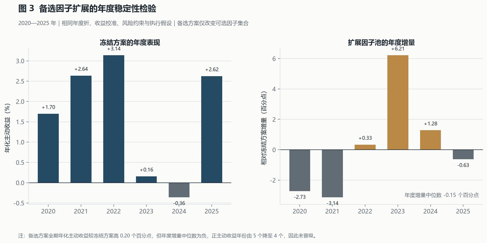

# 技术说明

本文记录 v2.1 的数据口径、因子研究、信号合成、组合优化、执行假设和评价方法。公开结果来自指纹校验后的聚合制品；行情、信号、持仓和成交明细不随仓库分发。

## 1. 研究问题与评价范围

研究对象是历史中证 500 成分股，基准代码为 `000905.SH`。系统每 5 个开放交易日生成一次信号，收盘后确定目标权重，下一开放日开盘执行。

个股标签采用未来 5 个交易日相对中证 500 的几何主动收益：

```math
y_{i,t}=\frac{P^{\mathrm{adj}}_{i,t+6}/P^{\mathrm{adj}}_{i,t+1}}
{B_{t+6}/B_{t+1}}-1.
```

标签到终点开盘后才视为可得。任一拟合日只使用此前已经成熟的标签，并在训练末端保留 5 个开放交易日的隔离带。

| 区间 | 用途 |
|---|---|
| 2016 | 最长价格窗口、复权和风险估计预热 |
| 2017—2019 | 首个年度折的初始训练样本 |
| 2020—2025 | 六个互不重叠的滚动年度评价折 |

研究时钟固定为：

```text
t 日及以前可得数据
  → t 日收盘后计算因子
  → 使用已成熟且通过隔离带的训练标签拟合
  → 生成截面得分和预期主动收益
  → 求解目标权重
  → t+1 日开盘尝试成交
  → 未成交部分继续持有
```

## 2. 数据与时点处理

### 2.1 数据输入

数据接口包括交易日历、指数权重、股票和指数日线、复权因子、涨跌停价格、每日指标、证券主表、停复牌、历史名称、申万行业，以及财务指标、利润表、资产负债表、现金流量表和财报披露日期。

| 数据 | 时点规则 |
|---|---|
| 指数成分 | 按公告的实际生效日切换，不用当前成分回填历史 |
| 指数权重 | 使用严格早于决策日的最近月末截面；生效日至新权重可得前使用带来源标记的冻结代理权重 |
| 行业 | 使用历史有效区间；申万 2014 与 2021 分类按生效日衔接 |
| 名称和 ST | 按历史有效区间判断 |
| 停复牌和涨跌停 | 按执行日状态限制买卖方向 |
| 行情和复权 | 因子只读取决策日收盘前历史；成交使用下一日复权开盘价 |
| 财务报表 | 取公告日、实际公告日和披露日期中的最晚值，下一开放日生效 |

原始响应按请求参数缓存，标准表按年度或接口物化。质量检查覆盖字段、主键、日期、成分数量、跨表关系和财务覆盖率。每次研究运行记录实际输入、配置和源码的 SHA-256；任一内容变化都会形成新的运行身份。

### 2.2 历史成分与财务修订

成分层同时保存调入调出事件和不重叠的有效区间。月末指数权重用于对账成分差分，不推迟已经生效的调整。质量门禁检查公告先于生效、有效日属于开放日、每日成分数为 500，以及月末快照集合一致性。

财务接口的日期参数按公告窗口解释，报告期另行筛选。标准层保留同一股票、同一报告期的不同修订版本，并记录供应商行哈希和可得日。决策日查询只返回当时已公布的最新版本；缺失公告日不以报告期代替。财务值超过 180 天未更新时关闭相关因子。

### 2.3 可投资股票池

决策日股票必须属于当时有效的中证 500 成分，具备足够价格历史，并满足名称、ST、行业和风险输入要求。缺失行业进入独立未知组。已有持仓若失去建仓资格仍可减仓，但不得新增主动仓位。

## 3. 因子研究

### 3.1 截面处理

每个决策日、每个因子独立执行四步处理：覆盖率检查、5 倍中位数绝对偏差缩尾、对数流通市值和行业中性化、残差标准化。

```math
f_{i,t}^{\mathrm{clip}}
=a_t+b_t\log(\mathrm{FFMV}_{i,t})
+\sum_k c_{k,t}I_{i,k,t}+\varepsilon_{i,t},
\qquad
z_{i,t}=\frac{\varepsilon_{i,t}-\bar\varepsilon_t}{s(\varepsilon_t)}.
```

因子目录给出固定经济方向。方向处理后，数值越高表示预期主动收益越高。完整 42 因子定义见附录 A。

### 3.2 折内筛选

每个拟合点最多读取最近 156 个成熟训练截面，并计算：

- 截面覆盖率和有效日期比例；
- 定向 Spearman Rank IC、方向一致率和 Newey–West 统计量；
- Benjamini–Hochberg 修正后的 q 值；
- 五分组单调性、费前和费后 Q5−Q1 收益；
- 相邻截面排名变化率；
- 四个连续时间块中的 IC 与费后价差稳定性。

费后分组收益扣除双边 5 个基点线性成本和卖出印花税。绝对相关系数不低于 0.75 的因子通过传递闭包归为同一簇，每簇最多保留 1 个；每个经济家族最多 2 个；总数为 5—10 个。硬门槛后不足 5 个时，主动信号直接关闭，不以低质量因子补足数量。

### 3.3 单因子审计结果

全样本审计覆盖 2017—2025 年、438 个决策日和 21.9 万条截面记录。42 个候选中 14 个通过覆盖率、时点一致性、IC 和费后价差联合门槛。表中 Sharpe 按 5 日持有期年化，最大回撤由逐调仓费后 Q5−Q1 收益计算。

| 因子 | 家族 | 定向 Rank IC | 费后 Sharpe | 最大回撤 |
|---|---|---:|---:|---:|
| `low_range_vol_20` | 风险 | 0.0458 | 0.142 | -21.86% |
| `low_idio_vol_60` | 风险 | 0.0454 | 0.681 | -18.35% |
| `free_turnover_20` | 流动性 | 0.0435 | 0.242 | -22.33% |
| `low_downside_vol_60` | 风险 | 0.0340 | 0.235 | -22.93% |
| `earnings_yield_ttm` | 估值 | 0.0276 | 0.796 | -13.11% |
| `amihud_20` | 流动性 | 0.0221 | 0.659 | -16.59% |
| `book_to_market` | 估值 | 0.0215 | 0.465 | -17.87% |
| `cfo_yield_ttm` | 估值 | 0.0202 | 0.831 | -18.16% |
| `momentum_250_20` | 动量 | 0.0176 | 0.806 | -14.18% |
| `sales_to_price_ttm` | 估值 | 0.0146 | 0.682 | -11.04% |
| `cash_return_on_assets_ttm` | 质量 | 0.0142 | 0.602 | -18.96% |
| `roe_change_yoy` | 成长 | 0.0111 | 0.536 | -20.65% |
| `gross_profitability_ttm` | 质量 | 0.0083 | 0.359 | -23.70% |
| `total_accruals_ttm` | 应计 | 0.0075 | 0.679 | -18.92% |

14 个因子的定向 Rank IC 中位数为 0.0209，费后 Sharpe 中位数为 0.631，最大回撤中位数为 -18.63%。这是全样本单因子诊断，不替代每个年度折中的重新筛选。

## 4. 合成信号与收益校准

通过筛选的因子先在经济家族内按方向等权，再在有效家族之间等权。个股缺失部分因子时，只在可用因子和可用家族内重新归一化；低于最低可用比例时不输出得分。

```math
F_{g,i,t}=\frac{1}{|S_{g,t}|}\sum_{j\in S_{g,t}}d_jz_{j,i,t},
\qquad
s_{i,t}=\sum_{g\in G_t}\omega_{g,t}F_{g,i,t}.
```

单因子权重上限为 20%，单一因子家族上限为 35%，有效因子至少 5 个、有效家族至少 3 个。该设计把统计筛选与经济暴露分散分开：IC 决定因子能否进入，家族结构控制同类信号集中。

滚动岭回归把合成得分映射为未来 5 日预期主动收益：

```math
(\widehat a_t,\widehat b_t)
=\arg\min_{a,b}\sum_{(i,u)\in\mathcal T_t}
\left(y_{i,u}-a-bs_{i,u}\right)^2+10b^2,
\qquad
\widehat\mu_{i,t}=\widehat a_t+\widehat b_t s_{i,t}.
```

训练标签缩尾至 ±20%，得分缩尾至 ±3，回归斜率和单票预期收益分别限制在 ±5% 和 ±10%。每次拟合保存训练区间、最后成熟标签日、系数和样本数。

2020—2025 年共有 236 个有效信号决策日和 117,724 个已实现标签。合成信号的日均 Rank IC 为 0.0345，五分组单调性为 0.70，Q5−Q1 平均收益为每 5 日 9.87 个基点，年化 Sharpe 为 0.498，最大回撤为 -9.82%。该分组收益没有扣除组合交易成本，因此只用于检查信号转化，不作为可交易业绩。

## 5. 风险、组合优化与执行

### 5.1 风险估计

协方差使用决策日及以前最多 252 个交易日的复权收益，并采用 Ledoit–Wolf 收缩：

```math
\widehat\Sigma=(1-\rho)S+\rho T.
```

少于 120 个有效观测的股票使用 80% 年化波动率回退，目标权重不得超过调仓前权重与基准权重的较大者。Beta 使用 60 日个股与中证 500 收益协方差估计；缺失时回退到 1。

```math
\widehat\beta_i=\frac{\mathrm{Cov}(r_i,r_B)}{\mathrm{Var}(r_B)}.
```

### 5.2 主动组合优化

设目标权重、基准权重、调仓前权重、预期主动收益和日频协方差分别为 `w`、`b`、`w0`、`mu` 和 `Sigma`。优化目标为：

```math
\max_w\quad
\widehat\mu^{\mathsf T}(w-b)
-\gamma(w-b)^{\mathsf T}(5\Sigma)(w-b)
-c_b\lVert(w-w_0)^+\rVert_1
-c_s\lVert(w_0-w)^+\rVert_1
-\eta\lVert w-b\rVert_2^2.
```

基准参数为风险厌恶系数 3、主动偏离惩罚 0.01。约束如下：

| 约束 | 上限或规则 |
|---|---|
| 投资方向 | 多头满仓 |
| 单票权重 | 3% |
| 单票主动权重 | ±1% |
| 行业主动暴露 | ±2% |
| 主动 Beta | ±0.05 |
| 年化事前跟踪误差 | 5% |
| 常规单边换手 | 35% |
| 单次交易容量 | 决策日可得 20 日 ADV 的 5% |

若严格配置约束因不可交易持仓、换手或容量而不可行，优化器先最小化标准化约束缺口，再在最小缺口附近求收益—风险—成本最优解。收益目标不能以扩大配置缺口换取更高预期收益。目标组合和成交后组合分别审计，物质性阈值为 1 个基点。

### 5.3 执行与成本

订单在下一开放日按复权开盘价执行，先卖后买；买单在现金不足时等比例缩放。停牌、涨跌停、ST 禁买和 ADV 容量会造成部分成交或阻断。流动性快照在信号日收盘冻结，严格早于执行日。

成本模型包括双边 5 个基点线性成本；卖出印花税在 2023-08-28 前为 10 个基点、之后为 5 个基点；冲击成本随成交额和 ADV 参与率变化，在 5% ADV 处为 10 个基点。回测使用连续份额记账。

## 6. 滚动年度验证

六个年度折按时间顺序执行。每折训练集从 2017 年起扩展到评价年之前，评价区间互不重叠。年度边界、训练截止日、最后可用标签日、隔离带和数据快照哈希随任务保存。

年度任务可并行运行，但单任务保持确定性。恢复时核验任务身份和全部制品指纹，只重跑失败任务。合并前检查日期唯一、折间不重叠、成本合同一致、模型只在首个评价调仓日前拟合，以及训练标签没有越过隔离带。合并净值由逐日收益重新计算，不直接拼接各折重置后的净值。

## 7. 实证结果

### 7.1 单因子、合成信号与组合

| 层级 | 核心指标 | 成本口径 |
|---|---|---|
| 单因子 | Rank IC 中位数 0.0209；Q5−Q1 Sharpe 中位数 0.631；最大回撤中位数 -18.63% | 已扣分组换手的线性成本和印花税 |
| 合成信号 | Rank IC 0.0345；Q5−Q1 每 5 日 9.87 个基点；Sharpe 0.498；最大回撤 -9.82% | 未扣组合交易成本 |
| 主动组合 | 年化主动收益 1.64%；信息比率 0.388；主动最大回撤 -6.64% | 已扣完整模型化成本 |

### 7.2 组合汇总

| 指标 | 结果 |
|---|---:|
| 组合 / 基准累计收益 | 81.34% / 65.22% |
| 累计相对收益 | 9.76% |
| 年化主动收益 | 1.64% |
| 信息比率 / 跟踪误差 | 0.388 / 4.45% |
| 组合 / 基准绝对 Sharpe | 0.601 / 0.516 |
| 组合 / 基准最大回撤 | -35.67% / -35.91% |
| 主动最大回撤 | -6.64% |
| CAPM 年化 Alpha / Beta | 2.02% / 0.956 |
| 正主动收益年度 | 5/6 |
| 平均单期换手 | 2.22% |
| 执行成本 | 成交金额的 11.05 个基点 |
| 成交金额完成率 / 优化求解率 | 99.74% / 98.96% |

2020—2025 年结果来自滚动研究折，不是新的独立最终留出样本。绝对 Sharpe 采用日收益、无风险利率取 0；信息比率采用主动日收益。

### 7.3 预登记门槛

12 项发布门槛通过 8 项。未通过项如下：

| 指标 | 门槛 | 结果 |
|---|---:|---:|
| 年化主动收益 | 不低于 3.00% | 1.64% |
| 信息比率 | 不低于 0.800 | 0.388 |
| 主动最大回撤 | 不低于 -6.00% | -6.64% |
| 滚动 Beta 偏离 95% 分位数 | 不高于 0.100 | 0.163 |

### 7.4 未采用方案

在相同训练、风险、优化和执行口径下，因子扩展实验加入 6 个 A 股交易行为候选。全期年化主动收益由 1.64% 升至 1.84%，但年度增量中位数为 -0.15 个百分点，正主动收益年度由 5 个降至 4 个，主动最大回撤、换手和成本均变差，因此没有替换基准方法。



另一项实验先把新增信号对核心信号做截面残差化，再用时序折外的费后增量证据决定候选占比。六个评价年度中候选实际占比始终为 0，最终持仓与基准方法逐日一致。该机制证明弱证据下能够回退，但没有提供新增主动收益。

## 8. 完整性与复现

### 8.1 审计边界

研究运行记录数据快照、配置、源码、任务和制品指纹。报告生成时再次校验年度汇总、逐日净值、评价信号、评价标签、单因子结果和逐调仓分组收益的 SHA-256。公开 JSON 不包含本地绝对路径、凭证、逐行行情、信号、持仓或成交。

测试覆盖时点可得性、成分区间、财务修订、标签成熟、因子计算、优化约束、不可交易方向、成交容量、成本、年度折边界、断点恢复、报告指纹和公开 Markdown 格式。

### 8.2 运行

环境要求 Python 3.12。Tushare Token 只写入被 Git 忽略的 `.env`。

```powershell
uv sync --extra dev --extra report
Copy-Item .env.example .env

uv run python -m csi500_alpha doctor --config configs/full.yaml
.\scripts\download_tushare.ps1
.\scripts\download_eligibility.ps1
.\scripts\download_financial.ps1

.\scripts\run_factor_audit.ps1
.\scripts\run_v2_release.ps1 -Mode Run -Workers 4

uv run pytest
uv run ruff check .
uv run mypy src
```

市场数据和逐行研究制品不随仓库分发。凭相同 Tushare 权限完成数据构建后，可按配置重跑年度任务并重新生成聚合报告。

## 9. 研究边界

- 2020—2025 年同时用于滚动研究和方法比较，不能视为一次性最终留出样本。
- v1 已揭示的 2026 年上半年结果为负，已保留在归档报告中；该窗口不能再次用于独立检验。
- 成本、冲击和容量为模型估计，不代表实盘成交。
- 连续份额记账尚未覆盖 100 股整数手和完整公司行动台账。
- 原创代码采用 MIT License；Tushare 数据受供应商条款约束，不随代码许可再分发。

## 附录 A：42 因子目录

记 `P` 为复权收盘价，`p=log(P)`，`r` 为对数收益，`rm` 为中证 500 对数收益，`TO` 和 `TOf` 分别为总换手率和自由流通换手率。方向列表示进入合成前是否翻转原始值。

### A.1 价量因子

| 家族 | 因子 | 原始定义 | 方向 |
|---|---|---|---:|
| 反转 | `reversal_1d` | `-(p_t-p_{t-1})` | + |
| 反转 | `reversal_5d` | `-(p_t-p_{t-5})` | + |
| 反转 | `reversal_10d` | `-(p_t-p_{t-10})` | + |
| 反转 | `reversal_20d` | `-(p_t-p_{t-20})` | + |
| 动量 | `momentum_20_5` | `p_{t-5}-p_{t-20}` | + |
| 动量 | `momentum_60_20` | `p_{t-20}-p_{t-60}` | + |
| 动量 | `momentum_120_20` | `p_{t-20}-p_{t-120}` | + |
| 动量 | `momentum_250_20` | `p_{t-20}-p_{t-250}` | + |
| 风险 | `low_vol_20` | `-std_20(r)` | + |
| 风险 | `low_downside_vol_60` | `-sqrt(mean_60(min(r,0)^2))` | + |
| 风险 | `low_range_vol_20` | `-sqrt(mean_20(log(H/L)^2)/(4 log 2))` | + |
| 风险 | `beta_60` | `cov_60(r,rm)/var_60(rm)` | − |
| 风险 | `low_idio_vol_60` | `-sqrt(var_60(r)-cov_60(r,rm)^2/var_60(rm))` | + |
| 风险 | `skewness_60` | `skew_60(r)` | − |
| 风险 | `max_return_20` | `max_20(r)` | − |
| 流动性 | `amihud_20` | `log(mean_20(abs(r)/amount))` | + |
| 流动性 | `free_turnover_20` | `log(mean_20(TOf))` | − |
| 流动性 | `turnover_shock_5_60` | `log(mean_5(TO)/mean_60(TO))` | − |
| 流动性 | `zero_return_20` | `mean_20(1[abs(r)<=1e-12])` | + |
| 流动性 | `close_location_20` | `mean_20((2C-H-L)/(H-L))` | + |
| 规模 | `size` | `-log(float_market_value)` | + |
| 规模 | `total_size` | `-log(total_market_value)` | + |
| 规模 | `free_float_ratio` | `log(float_market_value/total_market_value)` | + |
| 估值 | `book_to_price` | `log(1/PB)` | + |
| 交互 | `abnormal_turnover_reversal` | `reversal_5d * max(turnover_shock_5_60,0)` | + |

### A.2 基本面因子

利润表和现金流量表的季报值先还原为单季流量，再以连续四季合成 TTM；资产和权益使用当期与上年同期平均值。金融行业只比较口径较一致的指标。

| 家族 | 因子 | 原始定义 | 方向 |
|---|---|---|---:|
| 质量 | `gross_profitability_ttm` | `(Revenue_TTM-OperCost_TTM)/AvgAssets` | + |
| 质量 | `roe_ttm` | `NetIncome_TTM/AvgEquity` | + |
| 质量 | `roa_ttm` | `NetIncome_TTM/AvgAssets` | + |
| 质量 | `operating_margin_ttm` | `OperatingProfit_TTM/Revenue_TTM` | + |
| 质量 | `cash_return_on_assets_ttm` | `CFO_TTM/AvgAssets` | + |
| 估值 | `book_to_market` | `Equity/MarketValue` | + |
| 估值 | `earnings_yield_ttm` | `NetIncome_TTM/MarketValue` | + |
| 估值 | `sales_to_price_ttm` | `Revenue_TTM/MarketValue` | + |
| 估值 | `cfo_yield_ttm` | `CFO_TTM/MarketValue` | + |
| 成长 | `revenue_growth_ttm_yoy` | `Revenue_TTM/Revenue_TTM_1y-1` | + |
| 成长 | `earnings_growth_ttm_yoy` | `(NI_TTM-NI_TTM_1y)/abs(NI_TTM_1y)` | + |
| 成长 | `cfo_growth_ttm_yoy` | `(CFO_TTM-CFO_TTM_1y)/abs(CFO_TTM_1y)` | + |
| 成长 | `roe_change_yoy` | `ROE_TTM-ROE_TTM_1y` | + |
| 投资 | `asset_growth_yoy` | `Assets_t/Assets_t_1y-1` | − |
| 投资 | `capex_intensity_ttm` | `Capex_TTM/AvgAssets` | − |
| 应计 | `total_accruals_ttm` | `(NetIncome_TTM-CFO_TTM)/AvgAssets` | − |
| 应计 | `cash_conversion_ttm` | `CFO_TTM/abs(NetIncome_TTM)` | + |

## 附录 B：指标定义

日度 Rank IC 是同一决策日的预期收益排序与未来主动收益排序之间的 Spearman 相关：

```math
\mathrm{IC}_t
=\mathrm{Corr}\!\left(
\mathrm{rank}(\widehat\mu_{i,t}),
\mathrm{rank}(y_{i,t})
\right).
```

收益序列的年化 Sharpe 按下式计算。日收益取年化频率 252，5 日调仓收益取 252/5；绝对 Sharpe 的无风险利率取 0。

```math
\mathrm{Sharpe}=\sqrt{K}\,\frac{\bar r}{s(r)}.
```

最大回撤从累计净值的历史高点计算：

```math
\mathrm{MDD}=\min_t\left(\frac{V_t}{\max_{u\le t}V_u}-1\right).
```

主动净值采用组合净值与基准净值之比；信息比率为主动日收益均值除以主动日收益标准差并按 252 年化。CAPM Alpha 和 Beta 由组合日收益对基准日收益的含截距回归得到。
