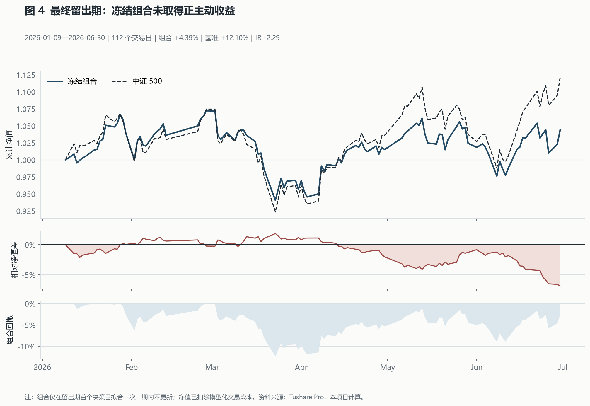
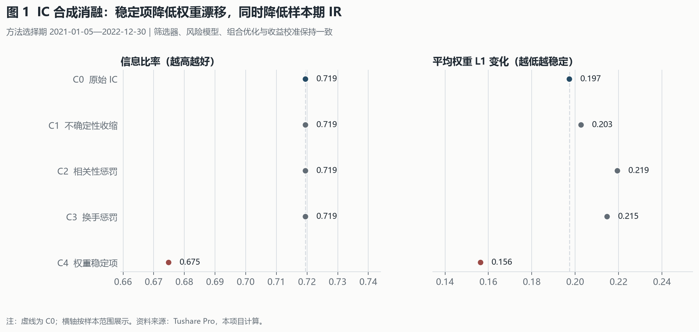
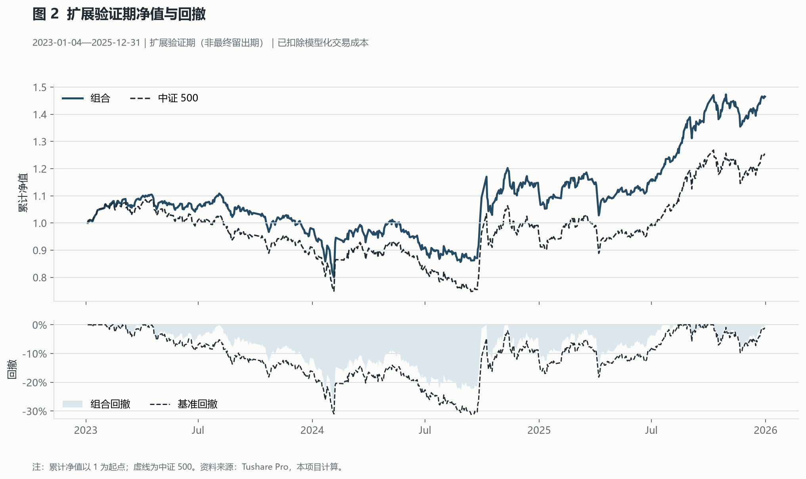
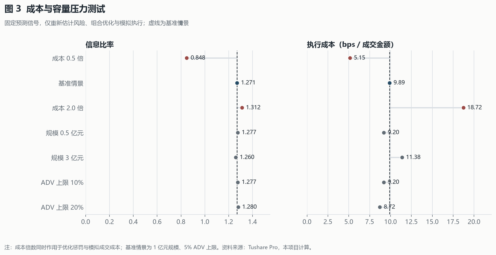

# 中证 500 时点一致多因子主动组合研究

[](https://github.com/Lithnio/csi500-alpha-research/actions/workflows/ci.yml)


本项目基于 Tushare Pro 构建中证 500 横截面研究样本，覆盖历史成分、因子检验、预期收益、风险估计、主动组合优化、次日开盘执行和结果审计。研究数据按当时可得信息对齐，回测包含停复牌、涨跌停、ST 限制、成交容量、印花税和冲击成本。

> **最终结论：** 冻结组合在 2026 年上半年取得 4.39% 收益，同期中证 500 收益为 12.10%，信息比率为 -2.29。最终留出样本不支持正主动收益；结果按预设口径保留，未据此修改模型或参数。

## 最终留出结果

| 指标 | 结果 |
|---|---:|
| 评价区间 | 2026-01-09—2026-06-30 |
| 组合 / 基准总收益 | 4.39% / 12.10% |
| 收益差 | -7.71 个百分点 |
| 年化主动收益 / 信息比率 | -16.98% / -2.286 |
| 跟踪误差 / 最大回撤 | 7.43% / -12.27% |
| 平均换手 / 执行成本 | 1.92% / 7.78 bps |
| 成交金额完成率 / 优化求解 | 99.92% / 23 次中 23 次 |



最终窗口的日均 Rank IC 为 0.0246，但五分组收益单调性为 -0.90，最高预期收益组的实际主动收益低于最低组。最终有效权重集中于低特质波动、低区间波动和低自由流通换手三个因子，分别为 35%、35% 和 30%。这说明排序信号在该窗口没有稳定转化为主动收益。

运行制品、研究输入和协议锁均通过哈希核验；关键指标由逐日净值与成交记录独立复算，最大差异为 0。公开聚合结果见 [final-holdout-summary.json](../assets/final-holdout-summary.json)，完整性检查见 [final-holdout-audit.json](../assets/final-holdout-audit.json)。

## 研究设计

| 区间 | 用途 |
|---|---|
| 2016 | 长窗口因子和风险估计预热 |
| 2017—2020 | 初始训练 |
| 2021—2022 | 方法选择与消融 |
| 2023—2025 | 扩展验证 |
| 2026-01—2026-06 | 一次性最终留出评价 |

```text
供应商数据 → 时点一致股票池与因子 → 训练期筛选 → IC 合成与收益校准
          → 协方差估计 → 主动组合优化 → 次日开盘执行 → 净收益与审计
```

标签定义为从决策日后第一个开盘价至第六个开盘价的个股收益减中证 500 收益。所有训练样本必须在拟合日之前完成标签观测，并额外设置 5 个交易日的隔离期。因子在每日截面内进行稳健缩尾、市值和行业中性化及标准化。

## 方法特点：不确定性与成本感知的 IC 合成

候选池包含 25 个反转、动量、风险、流动性、规模、估值和交互因子。每次拟合先按覆盖率、IC 方向、分段稳定性、五分组单调性、信号变化率、相关性和因子家族上限筛选，再对因子 IC 作经验贝叶斯收缩。合成权重由下式确定：

```math
\max_{w}\quad
\widetilde{\mu}_{IC}^{\mathsf T}w
-\lambda_{corr}w^{\mathsf T}Rw
-\lambda_{churn}c^{\mathsf T}w
-\lambda_{stable}\lVert w-w_{prev}\rVert_2^2,
\qquad
w\ge 0,\ \mathbf 1^{\mathsf T}w=1,\ w_i\le w_{max}.
```

其中，$`\widetilde{\mu}_{IC}`$ 为收缩后的有向 IC，$`R`$ 为因子相关冗余矩阵，$`c`$ 为信号变化率代理，$`w_{prev}`$ 为上一次拟合权重。该方法同时约束统计不确定性、重复暴露、交易活跃度和跨期权重漂移。



在 2021—2022 年的固定口径消融中，完整稳定项将平均权重 L1 变化从 0.215 降至 0.156，同时信息比率由 0.719 降至 0.675。该结果表明权重稳定性有所改善，但没有带来同窗口的收益提升。

## 扩展验证与压力测试

2023—2025 年扩展验证比较了相同筛选器、收益校准、风险模型和组合约束下的两种因子合成方法。

| 指标 | 方向等权 | IC 合成 |
|---|---:|---:|
| 组合总收益 | 45.64% | 46.50% |
| 年化主动收益 | 5.13% | 5.20% |
| 信息比率 | 1.141 | 1.271 |
| 最大回撤 | -28.57% | -27.79% |
| 平均换手 | 3.22% | 1.24% |
| 执行成本 | 10.58 bps | 9.89 bps |
| 2025 年信息比率 | 0.908 | 0.016 |



扩展验证期内，IC 合成提高了总体信息比率并降低换手，但优势主要来自 2023—2024 年，2025 年主动表现接近于零。压力测试固定预测信号，仅重新运行风险、组合优化和模拟执行；3 亿元规模下成交金额完成率为 98.09%，信息比率为 1.260。



扩展验证的聚合指标见 [public-summary.json](../assets/public-summary.json)，图表来源和输出哈希见 [report-manifest.json](../assets/report-manifest.json)。

## 实现内容

| 模块 | 实现 |
|---|---|
| 数据 | Tushare 请求缓存、年度分区、动态指数成分、历史行业、名称与停复牌区间、质量检查 |
| 因子 | 25 因子目录、可得时点、缺失规则、截面处理、IC 与五分组诊断 |
| 预测 | 训练期因子筛选、IC 收缩合成、滚动 Ridge 收益校准、拟合样本审计 |
| 风险与组合 | Ledoit–Wolf 协方差、主动权重、行业暴露、换手、单票和 ADV 容量约束 |
| 执行 | 次日开盘、先卖后买、不可交易方向、部分成交、印花税、线性成本与冲击成本 |
| 复现 | 配置驱动实验、数据与源码指纹、失败恢复、压力情景、聚合报告和离线测试 |

## 复现

要求 Python 3.12。Tushare Token 仅写入被 Git 忽略的 `.env`。

```powershell
uv sync --extra dev --extra report
Copy-Item .env.example .env

uv run python -m csi500_alpha doctor --config configs/full.yaml
.\scripts\download_tushare.ps1
.\scripts\download_eligibility.ps1

uv run python -m csi500_alpha run-study --study configs/studies/core_baselines.yaml
uv run python -m csi500_alpha run-study --study configs/studies/adaptive_bridge.yaml
uv run python -m csi500_alpha run-stress --stress configs/stress/adaptive_bridge_cost_capacity.yaml

uv run python -m pytest
uv run ruff check .
uv run mypy src
```

市场数据和逐行研究制品不随仓库分发，因此克隆仓库后不能直接还原已公布的净值路径；使用者可凭自己的 Tushare 权限按相同配置构建数据并运行研究。完整数据合同、因子公式、组合目标和审计口径见 [TECHNICAL.md](../../TECHNICAL.md)。

## 数据、许可与局限

- 原创代码采用 [MIT License](../../LICENSE)；市场数据仍受 Tushare 条款约束，MIT 许可证不授予数据再分发权。
- 回测成本和成交容量来自模型估计，不代表实盘成交；结果不构成投资建议。
- 最终留出期仅覆盖 2026 年上半年，统计区间较短。
- 历史行业覆盖存在一次非阻断告警；缺失行业进入独立未知组。
- 执行层采用连续份额记账，未包含 100 股整数手和完整公司行动台账。
